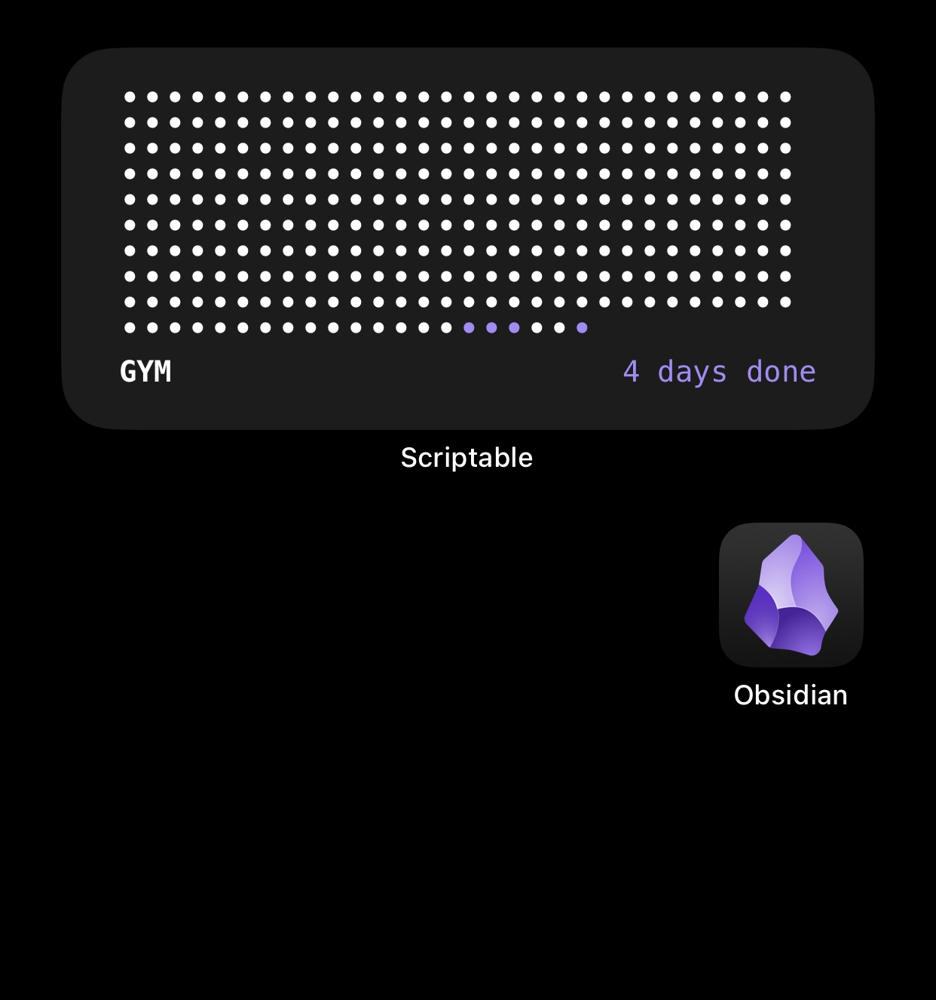

# Obsidian Tracker Scriptable Widget

A lightweight iOS/macOS Scriptable widget that integrates with Obsidian to give you quick at-a-glance tracking of your notes, habits, and progress — right from your home screen.

> **Note:** This widget is designed to work with a **currently under development Obsidian plugin** (not yet released). Until that plugin is available and installed, the widget will not function as intended.

---

## Preview

---

## Features

- View key Obsidian tracker data directly on your home screen  
- Auto-refreshes by reading data from your Obsidian vault  
- Simple configuration inside the Scriptable app  
- Built to pair with a dedicated Obsidian tracking plugin (in development)

---

## Requirements

- iOS / iPadOS (or macOS with Scriptable support)
- [Scriptable](https://scriptable.app/) installed
- Access to your Obsidian vault files from the device
- The companion **Obsidian tracking plugin (WIP)** configured to export data in the expected format

---

## Installation

1. **Download the script**
   - Copy `Obsidian-Tracker-Scriptable-Widget.js` into your Scriptable scripts folder (or create a new script in Scriptable and paste the contents).

2. **Configure file paths**
   - In Scriptable, open the script.
   - Adjust any configuration section at the top (e.g. path to your Obsidian vault, data file name, plugin export folder) to match your setup.

3. **Add the widget**
   - Long-press on your iOS home screen and tap the **+** button.
   - Search for **Scriptable** and add a widget.
   - Edit the widget and select the `Obsidian-Tracker-Scriptable-Widget` script.
   - (Optional) Configure parameters (if used) for different vaults or views.

---

## How It Works

- The companion Obsidian plugin (currently under development) will:
  - Process your notes, trackers, or daily logs.
  - Export a small data file (e.g. JSON or text) into your vault or a shared folder.

- This Scriptable widget:
  - Reads the exported data file.
  - Renders a compact view (e.g. streak counts, completed tasks, progress bars, etc.) on your home screen.

Because the Obsidian plugin is still in development, the exact data format and configuration are subject to change.

---

## Configuration

Inside `Obsidian-Tracker-Scriptable-Widget.js` you’ll typically find options such as:

- `VAULT_PATH` – path to your Obsidian vault (or data export folder)
- `DATA_FILE_NAME` – filename the plugin exports
- Styling/layout options (font sizes, colors, compact vs detailed mode, etc.)

Adjust these values to match your environment. When the companion plugin is released, its documentation will describe the recommended configuration in more detail.

---

## Status & Roadmap

- Basic widget script
- Obsidian companion plugin (under active development)
- Better error handling and more layout presets
- Public plugin + widget configuration examples

---

## Troubleshooting

- **Widget shows no data or errors**
  - Confirm the Obsidian plugin has exported the data file.
  - Check that the file path in the script matches the actual location.
  - Try running the script directly in Scriptable to see log output.

- **Path or permission issues**
  - Ensure your Obsidian vault is accessible from the device and Scriptable has permission to read it (e.g. via Files/iCloud/On My iPhone).

---

## Credits

- Original idea and code: **jvscholz** https://jvscholz.com/blog/countdown.html
- Scriptable widget adaptation and integration with Obsidian: **bloxyj**

---

## Contributing

Contributions, ideas, and feedback are welcome:

- Open issues or feature requests
- Suggest improvements to the data format or widget layout
- Submit pull requests for bug fixes or enhancements

---

## License

This project is licensed under the terms described in `LICENSE` in this repository.